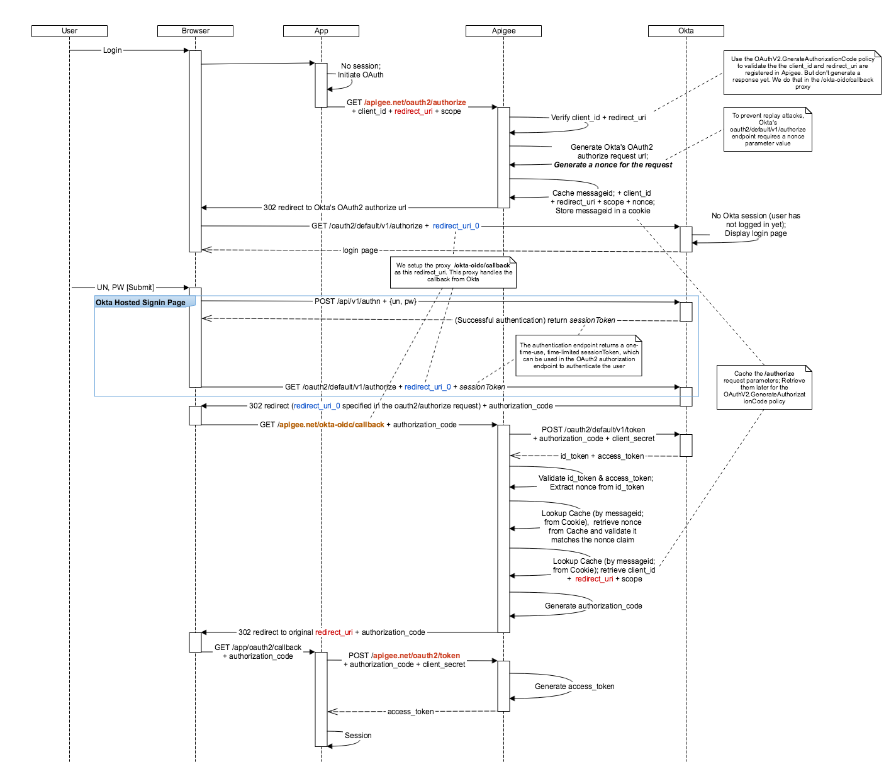

# Introduction
This sample builds upon Apigee's excellent [oauth andvanced sample](https://github.com/apigee/api-platform-samples/tree/master/sample-proxies/oauth-advanced) sample project, which demonstrates how to implement OAuth2 Authorization Code flow with Apigee. We have modified the sample by **"replacing" the Node.js "login-app" with [Okta](https://developer.okta.com/product)**. Apigee is still the OAuth2 Authorization Server for cour client(s), but at a high level it has also become an "OpenID Connect Client," authenticating into Okta (the "IdP"). By delegating Authentication to Okta, you get to leverage Okta's enterprise grade security Identity Management features. Just some of the things you can do with Okta include:
* Add Social Auth capabilities to your application
* Seamlessly connect to an 3rd party SAML and OpenID Connect IdPs
* Provide MFA
* Logging of all events
...All without writing a single line of code.

Below is a diagram describing the modified flow:



## <a name="prerequisites">Prerequisites
### Tools
To run this sample, you'll need:
* node.js and npm [installed](https://nodejs.org/)

* Yeoman [installed](http://yeoman.io/)

### Apigee Account
* The *Admin* username and password that you use to login to `enterprise.apigee.com`.

* The name of the organization in which you have an account. Login to
  `enterprise.apigee.com` and check account settings.

### Okta Account
* Sign up for a free Developer Account [developer.okta.com](https://developer.okta.com/signup)

#### Register an OpenID Connect Client (the "Apigee" Client)
* Once you have access to the Developer Console, from there create an OpenID Connect client:
    - From the menu options, navigate to Applications > Add Application > Web
    - Provide a name for your app, e.g. `Apigee-Client`
    - Leave Base URI as-is
    - IMPORTANT: Enter the "Login redirect URI" with the value `https://{myorg}-{myenv}.apigee.net/okta-oidc/callback`. For example, If myorg == `"okta_oidc"`, and I am deploying to the `"test"` environment, then the redirect URI is `https://okta_oidc-test.apigee.net/okta-oidc/callback`
    - Click through to complete the App setup
    - Once complete, you can find the `client_id` and `client_secret` in the "General" tab. You will need these values when you run the Yeoman tool

* Please note that the sample does not run properly in Windows 10.  Please run in macOS or Linux for full compatibility.

## <a name="deploy">Deploying
1. Create a directory and 'cd' into it
e.g.
```
> mkdir example-project
> cd example-project
```

2. Clone this repository into the directory you just created
```
> git clone git@github.com:zeekhoo-okta/generator-okta-oidc-apigee.git
```

3. 'cd' into the "generator" directory:
```
> cd generator-okta-oidc-apigee
```

4. Install dependencies
```
> npm install
```

5. In order to run the Yeoman tool, you'll need to symlink this local module to a global one using this command:
```
> npm link
```
This will install your project dependencies and symlink a global module to your local file. After npm is done, you will be able to call `yo generator-name`

6. Call Yeoman:
    `yo okta-oidc-apigee`

7. Follow the prompts:

```
Sample Generator of OAuth Authorization Code Grant Type Proxies.
? Your Apigee admin username:
? Your Apigee admin password:
? Apigee Organization Name:
? Apigee Environment Name:
? Management API URL Endpoint: https://api.enterprise.apigee.com
? Your Okta "Org": dev-######.oktapreview.com
? The CLIENT_ID of the app you created in Okta:
? The CLIENT_SECRET of the app you created in Okta:
? Id of the AuthorizationServer you configured to use in Okta (your Developer account comes with a pre-configured "default" AS): default
```
*Note: Obtain the CLIENT_ID and CLIENT_SECRET values from the App you registered in Okta from previous steps. Your Okta account should have a "default" AuthorizationServer so use that value if you're new to Okta.*

## <a name="testit">Running the sample

1. Open a browser and navigate to the sample "web application":

    `http://myorg-myenv.apigee.net/web`

    For example:

    `http://okta_oidc-test.apigee.net/web`

2. Initiate the flow.  Just click the `[Apigee+Okta Example Login]` button. This action sends a request to the `/oauth2/authorize` proxy endpoint, initiating OAuth2. The AuthorizationServver (Apigee) which redirects the browser to Okta for login.
